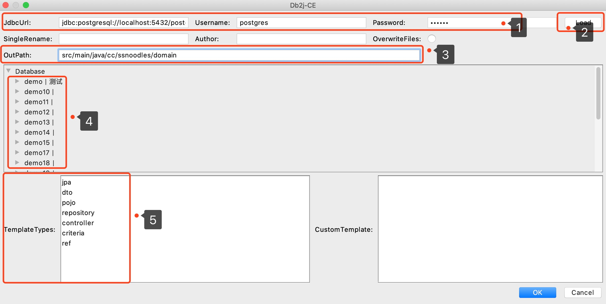

# Db2j-CE idea plugin
Features：Select database tables to generate java files. 

Support: 
* entity class
* repository interface

Idea Version：Community 2018.1+

[Plugin Site](https://plugins.jetbrains.com/plugin/13768-db2j-ce)

# Plugin Installation：
- Marketplace:
  - **Preferences** > **Plugins** > **Marketplace** > **Search for "Db2j-CE"** > **Install Plugin**
- Manual:
  - Download the [jar](https://github.com/SShnoodles/db2j-ce-idea-plugin/releases) and install it manually using **Preferences** > **Plugins** > **Install plugin from disk...**

# Update log
1.0.2 Community 2019.1+
* Fixed windows url error 

1.0.1 Community 2019.1+
* Support select columns

1.0.0 Community 2018.1+
* Support entity class、repository interface

# Quick Start
Open plugin from **Tools** > **Db2j-CE**
1. Enter Database Info
2. Load Database Tables
3. Enter Out Path
4. Select the tables
5. Select the templates



# Dependencies
* [db2j-ce](https://github.com/SShnoodles/db2j-ce)

# Jdbc Driver version
```groovy
compile group: 'org.postgresql', name: 'postgresql', version: '42.2.9'
compile group: 'mysql', name: 'mysql-connector-java', version: '8.0.18'
compile group: 'com.oracle', name: 'ojdbc6', version: '11.2.0.3'
```

# Reference projects
* [plugin doc](http://www.jetbrains.org/intellij/sdk/docs/tutorials/build_system/prerequisites.html)
* [EasyCode](https://github.com/makejavas/EasyCode)

